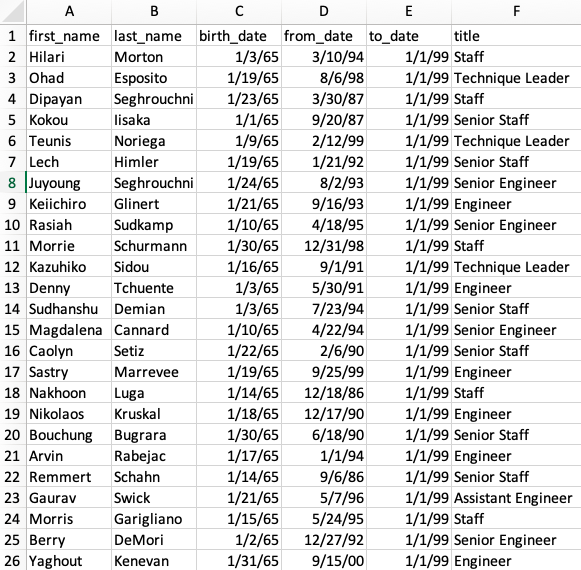

# Pewlett-Hackard-Analysis

## Overview of the analysis: Explain the purpose of this analysis.
Pewlett Hackard is approaching a transformational time in its history. They are expecting a high number of employees to retire. In effors to appropriatley plan for this shift in the company, this analysis looks at how many people across each department are nearing retirement. The analysis also aims to determine if they have enough people to mentor the next generation of employeed. 

### Results: Four major points from the two analysis deliverables. 
  1. Senior Engineers and Senior Staff roles will experience the highest turnover due to retirement. These two roles have over 57,000 retirment ready employees, accounting for more than half of the employees approching retirment. 
  2.Engineers at all levels will be in high demand. 
  3. The company would only be able to extend participation in the mentorship program to 1,549 employees.
  4. Manager is the role with the lowest number of retirement ready employees. Only 2 managers are expected to retire. 

### Summary

When the "silver tsunami" hits, the company will have to fill a total of 90,398 roles. Based on the analysis the company has 1,549 qualified mentors. The company will absolutley loose a lot of it's "human" knowledge. Though a mentorship program would be effective, the company should consider an initiative that would allow for knowledge from near retirment employees to be shared more widley, even with individuals who will be hired to replace them. 

